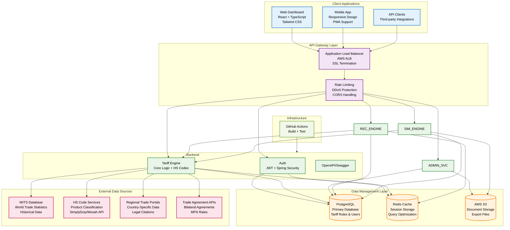

# TariffSheriff

[](https://tariffsheriff-frontend.vercel.app/) [](https://github.com/SaaiAravindhRaja/TariffSheriff/actions) [](https://github.com/SaaiAravindhRaja/TariffSheriff/releases)

A full-stack web application that helps businesses calculate and analyze import tariffs and fees across countries, with a focus on the **Electric Vehicle (EV) industry**.

---

<p align="center">


</p>

---

## Features

- **Accurate Tariff Calculations** - Real-time import duty calculations across multiple countries
- **EV Industry Focus** - Specialized data for Electric Vehicle trade compliance  
- **Route Optimization** - Find the most cost-effective shipping routes
- **Transparent Pricing** - Detailed breakdowns with legal citations
- Optional features (AI assistant, admin/ops tooling) are not enabled by default in this branch to keep the core small for class use. AI can still be enabled via backend profile `ai`.

---

## Development Quickstart

**Prerequisites:** Node.js 18+, npm 9+, Java 17, Docker (Docker Desktop or Colima).

```bash
# 1. Install dependencies (from repo root)
npm ci

# 2. Start PostgreSQL once (reuse this container for future runs)
docker run -d --name tariffsheriff-postgres \
  -e POSTGRES_USER=tariff_sheriff \
  -e POSTGRES_PASSWORD=tariff_sheriff \
  -e POSTGRES_DB=tariffsheriff \
  -p 5432:5432 \
  postgres:16

# 3. Start the backend (Flyway will auto-run migrations and seed data)
# export DOCKER_HOST="$(docker context inspect --format '{{.Endpoints.docker.Host}}')"  # only required for Colima/rootless Docker
(cd apps/backend && mvn spring-boot:run)

# 4. In another terminal (from repo root), start the frontend dev server
npm run dev --workspace=frontend

# Dev servers
#   Frontend: http://localhost:3000
#   Backend : http://localhost:8080

# 5. Automated checks before committing
mvn test                     # backend (Testcontainers)
npm run test --workspace=frontend

# 6. AI Assistant (optional): run with profile
# (cd apps/backend && mvn spring-boot:run -Dspring-boot.run.jvmArguments="-Dspring.profiles.active=ai")

# 7. CI builds and tests are handled by GitHub Actions (.github/workflows/ci.yml)
```

> Need a clean database? Stop the backend, remove any local Postgres container (e.g. `docker rm -f tariffsheriff-postgres`), then rerun `mvn spring-boot:run` to replay Flyway migrations and the mock seed.

---

## Live Demo

[https://tariffsheriff-frontend.vercel.app/](https://tariffsheriff-frontend.vercel.app/)
___


## System Architecture



## Project Structure

```
apps/
	backend/    # Spring Boot backend API
	frontend/   # React + Vite frontend UI
packages/     # Shared libraries (types, utils)
docs/         # Documentation
infrastructure/ # Docker, K8s, CI/CD configs
```

## Data Flow & Business Logic


## Core Business Logic

### Tariff Calculation Engine
- **Input Processing**: Product category (HS code), origin/destination countries, transaction details
- **Rule Matching**: Applies appropriate tariff rules based on trade agreements and validity periods
- **Rate Calculation**: Supports percentage-based and flat fee structures
- **Citation Generation**: Provides transparent rule references for compliance

### Key Features
- **HS Code Resolution**: Automatic product classification using harmonized system codes
- **Multi-Country Support**: Handles bilateral and multilateral trade agreements
- **Time-Sensitive Rules**: Applies correct rates based on transaction dates
- **MFN Treatment**: Most-Favored-Nation rate calculations
- **Certificate Handling**: Processes origin certificates and special conditions

---

## Getting Started

```bash
# 1. Install dependencies (from repo root)
npm ci

# 2. Start the backend (Spring Boot)
cd apps/backend && ./mvnw spring-boot:run

# 3. Start the frontend (Vite)
npm run dev --workspace=frontend

# 4. Build frontend for production (from repo root)
npm run build
```

### Deployment (Vercel)

- If you deploy the monorepo to Vercel, the frontend app is in `apps/frontend`.
- Place a `vercel.json` inside `apps/frontend/` with:

```json
{
    "outputDirectory": "dist"
}
```

- Alternatively, in the Vercel project settings set the **Root Directory** to `apps/frontend` and the **Output Directory** to `dist`.
- The root-level `vercel.json` is intentionally minimal to avoid schema validation errors — per-app configs in subfolders are recommended for monorepos.

## Technology Stack

### Backend
- **Framework**: Spring Boot 3.1 with Java 17
- **Security**: Spring Security + JWT for stateless authentication
- **Database**: PostgreSQL with JPA/Hibernate
- **API Documentation**: Swagger/OpenAPI 3.0
- **Caching**: Redis for session management and query optimization
- **Testing**: JUnit 5 + Mockito

### Frontend
- **Framework**: React 18 with TypeScript
- **Build Tool**: Vite for fast development and building
- **Styling**: Tailwind CSS + Radix UI components
- **State Management**: TanStack Query for server state
- **Forms**: React Hook Form with Zod validation
- **Charts**: Recharts for data visualization
- **Animation**: Framer Motion for smooth interactions

### Infrastructure & DevOps
- **Containerization**: Docker + Docker Compose
- **Orchestration**: AWS ECS (Elastic Container Service)
- **CI/CD**: GitHub Actions for automated testing and deployment
- **Monitoring**: AWS CloudWatch for logs and metrics
- **Load Balancing**: AWS Application Load Balancer

### External Integrations
- **Trade Data**: World Integrated Trade Solution (WITS) API
- **Product Classification**: HS Code lookup services
- **Regional Data**: Country-specific trade portals


---

## Contributing

- See the [`docs/`](docs/) folder for guidelines and architecture decisions.
- Use atomic, logical commits for all changes.

---


## Contributors

<table>
	<tr>
		<td align="center">
			<a href="https://github.com/SaaiAravindhRaja">
				<br/>
				<sub><b>Saai</b></sub>
			</a>
		</td>
		<td align="center">
			<a href="https://github.com/thanh913">
				<br/>
				<sub><b>Billy</b></sub>
			</a>
		</td>
		<td align="center">
			<a href="https://github.com/minyiseah">
				<br/>
				<sub><b>Min yi</b></sub>
			</a>
		</td>
		<td align="center">
			<a href="https://github.com/LSH-Tech-tp">
				<br/>
				<sub><b>Sing Ho</b></sub>
			</a>
		</td>
		<td align="center">
			<a href="https://github.com/GarvitSobti">
				<br/>
				<sub><b>Garvit</b></sub>
			</a>
		</td>
		<td align="center">
			<a href="https://github.com/nathan11474">
				<br/>
				<sub><b>Nathan</b></sub>
			</a>
		</td>
	</tr>
</table>

---

## License

This project is private and not yet licensed for public use.
