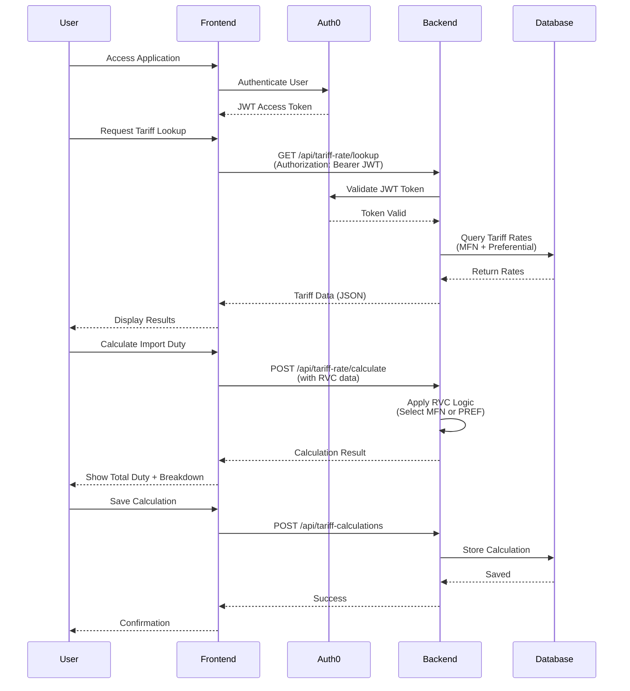

# 👮 TariffSheriff

[](https://tariffsheriff-frontend.vercel.app/) [](https://github.com/SaaiAravindhRaja/TariffSheriff/actions) [](https://github.com/SaaiAravindhRaja/TariffSheriff/releases)

---

<p align="center">
  
</p>

---

A comprehensive trade intelligence platform for calculating import duties, analyzing tariff rates, and exploring international trade agreements. Built with modern web technologies and designed for accuracy, transparency, and ease of use.

## Overview

TariffSheriff simplifies the complex world of international trade by providing real-time tariff calculations, HS code lookups, and trade agreement analysis. Whether you're an importer, exporter, customs broker, or trade analyst, TariffSheriff delivers the data you need to make informed decisions.

### 🚀 Features

---

- 📊 **Accurate Tariff Calculations** - Real-time import duty calculations with MFN and preferential rates
- 🔍 **HS Code Search** - Search and browse Harmonized System product codes with detailed descriptions
- 🌍 **Trade Agreements** - Explore bilateral and multilateral trade agreements with RVC thresholds
- 🗺️ **Country Database** - Access comprehensive country trade data with ISO3 standardization
- 🤖 **AI Assistant** - Optional GPT-powered chatbot for intelligent tariff queries and recommendations
- 📰 **News Intelligence** - Stay updated with trade-related news and policy changes
- 💾 **Saved Calculations** - Store and retrieve tariff calculations for future reference

---

## System Flow



### Technology Stack

| Layer | Technologies |
|-------|-------------|
| **Frontend** | React 18, TypeScript, Vite, TailwindCSS, Radix UI, Framer Motion, TanStack Query |
| **Backend** | Spring Boot 3.5, Java 17, Spring Security, Spring Data JPA, Hibernate |
| **Database** | PostgreSQL 16, Flyway Migrations |
| **Authentication** | Auth0 (OAuth2/OIDC), JWT Resource Server |
| **AI/ML** | OpenAI GPT-4o-mini (optional) |
| **DevOps** | Docker, Docker Compose, GitHub Actions CI/CD |
| **Deployment** | Vercel (Frontend), Cloud-hosted (Backend) |

## Getting Started

### Prerequisites

- **Node.js** 18+ and npm 9+
- **Java** 17 (JDK) and Maven 3.9+
- **PostgreSQL** 16+ (or Docker)

### Quick Start

1. **Clone the repository**
   ```bash
   git clone https://github.com/SaaiAravindhRaja/TariffSheriff.git
   cd TariffSheriff
   ```

2. **Install dependencies**
   ```bash
   npm ci
   ```

3. **Set up PostgreSQL**
   
   Using Docker (recommended):
   ```bash
   docker run -d --name tariffsheriff-postgres \
     -e POSTGRES_USER=tariff_sheriff \
     -e POSTGRES_PASSWORD=tariff_sheriff \
     -e POSTGRES_DB=tariffsheriff \
     -p 5432:5432 postgres:16
   ```
   
   Or use a cloud provider like [Neon](https://neon.tech), AWS RDS, or Google Cloud SQL.

4. **Configure Backend**
   
   Create `apps/backend/.env`:
   ```env
   # Database
   DATABASE_URL=jdbc:postgresql://localhost:5432/tariffsheriff
   DATABASE_USERNAME=tariff_sheriff
   DATABASE_PASSWORD=tariff_sheriff
   
   # Auth0
   AUTH0_ISSUER=https://YOUR_TENANT.us.auth0.com/
   AUTH0_AUDIENCE=https://api.tariffsheriff.com
   
   # JWT (for local dev)
   JWT_SECRET=your-256-bit-secret-here
   
   # Optional: AI Assistant
   OPENAI_API_KEY=sk-...
   ```

5. **Configure Frontend**
   
   Create `apps/frontend/.env.local`:
   ```env
   VITE_API_BASE_URL=http://localhost:8080/api
   VITE_AUTH0_DOMAIN=YOUR_TENANT.us.auth0.com
   VITE_AUTH0_CLIENT_ID=YOUR_CLIENT_ID
   VITE_AUTH0_AUDIENCE=https://api.tariffsheriff.com
   VITE_AUTH0_REDIRECT_URI=http://localhost:3000
   ```

6. **Start the application**
   
   Option A - Use convenience script:
   ```bash
   ./start-app.sh
   ```
   
   Option B - Manual start:
   ```bash
   # Terminal 1: Backend
   cd apps/backend
   mvn spring-boot:run
   
   # Terminal 2: Frontend
   npm run dev --workspace=frontend
   ```

7. **Access the application**
   - Frontend: http://localhost:3000
   - Backend API: http://localhost:8080/api
   - Swagger UI: http://localhost:8080/swagger-ui.html

## 📚 API Documentation

Full interactive API documentation available at `/swagger-ui.html` when running the backend.

### Core Endpoints

**Authentication**
- `POST /api/auth/register` - Register new user
- `POST /api/auth/login` - Login with credentials
- `POST /api/auth/validate` - Validate JWT token

**Tariff Operations**
- `GET /api/tariff-rate/lookup` - Lookup tariff rates by country and HS code
- `POST /api/tariff-rate/calculate` - Calculate total duty with RVC analysis
- `GET /api/countries` - List all countries
- `GET /api/agreements` - List trade agreements
- `GET /api/agreements/by-country/{iso3}` - Get agreements for specific country
- `GET /api/hs-products/search` - Search HS codes by description

**Saved Calculations**
- `GET /api/tariff-calculations` - List saved calculations
- `POST /api/tariff-calculations` - Save a calculation
- `GET /api/tariff-calculations/{id}` - Get calculation details
- `DELETE /api/tariff-calculations/{id}` - Delete a calculation

## 🛠️ Development

### Project Structure

```
TariffSheriff/
├── apps/
│   ├── backend/                 # Spring Boot API
│   │   ├── src/main/java/       # Java source code
│   │   │   └── com/tariffsheriff/backend/
│   │   │       ├── auth/        # Authentication & authorization
│   │   │       ├── tariff/      # Tariff rate services
│   │   │       ├── tariffcalculation/  # Calculation engine
│   │   │       ├── chatbot/     # AI assistant
│   │   │       ├── news/        # News intelligence
│   │   │       └── config/      # Spring configuration
│   │   ├── src/main/resources/
│   │   │   ├── db/migration/    # Flyway SQL migrations
│   │   │   └── application.properties
│   │   ├── pom.xml              # Maven dependencies
│   │   └── Dockerfile
│   │
│   └── frontend/                # React application
│       ├── src/
│       │   ├── components/      # Reusable UI components
│       │   ├── pages/           # Page components
│       │   ├── hooks/           # Custom React hooks
│       │   ├── services/        # API client
│       │   ├── contexts/        # React contexts
│       │   ├── lib/             # Utilities
│       │   └── styles/          # Global styles
│       ├── package.json
│       └── vite.config.ts
│
├── docs/                        # Documentation
│   ├── api/                     # API documentation
│   └── database/                # Database documentation
│
├── scripts/                     # Deployment scripts
├── start-app.sh                 # Start both services
├── stop-app.sh                  # Stop both services
├── CONTRIBUTING.md              # Contribution guidelines
├── SECURITY.md                  # Security policy
└── README.md                    # This file
```

## 🤝 Contributing

We welcome contributions! Please see [CONTRIBUTING.md](CONTRIBUTING.md) for guidelines.

**Development Workflow:**
1. Fork the repository
2. Create a feature branch: `feat/your-feature-name`
3. Make your changes with clear commit messages
4. Run tests: `mvn test` and `npm test`
5. Submit a pull request

## 📄 License

This project is licensed under the Apache License 2.0 - see the [LICENSE](LICENSE) file for details.

## 👥 Contributors

<table><tr><td align="center"><a href="https://github.com/SaaiAravindhRaja"><br/><sub><b>Saai</b></sub></a></td><td align="center"><a href="https://github.com/thanh913"><br/><sub><b>Billy</b></sub></a></td><td align="center"><a href="https://github.com/minyiseah"><br/><sub><b>Min yi</b></sub></a></td><td align="center"><a href="https://github.com/LSH-Tech-tp"><br/><sub><b>Sing Ho</b></sub></a></td><td align="center"><a href="https://github.com/GarvitSobti"><br/><sub><b>Garvit</b></sub></a></td><td align="center"><a href="https://github.com/nathan11474"><br/><sub><b>Nathan</b></sub></a></td></tr></table>

## 💬 Support

- 📖 **Documentation**: See [docs/](docs/) folder
- 🐛 **Issues**: [GitHub Issues](https://github.com/SaaiAravindhRaja/TariffSheriff/issues)
- 💡 **Discussions**: [GitHub Discussions](https://github.com/SaaiAravindhRaja/TariffSheriff/discussions)

---

Made with ❤️ by the TariffSheriff team
