---

## 🚀 What is TariffSheriff?

👮 TariffSheriff is a full-stack web application that helps businesses calculate and analyze import tariffs and fees across countries, with a focus on the Electric Vehicle (EV) industry. It provides accurate, transparent, and defensible data for pricing, compliance, and financial planning.

---

## 🌐 Live Demo

[https://tariffsheriff-frontend.vercel.app/](https://tariffsheriff-frontend.vercel.app/)

___


## 🏗️ System Architecture

```mermaid
%%{init: {'flowchart': {'nodeSpacing': 60, 'rankSpacing': 60, 'curve': 'linear'}}}%%
graph TB
    %% User Layer
    subgraph "👥 User Layer"
    WEB[🌐 Web Interface\nReact + TS]
    MOB[📱 Mobile Interface\nResponsive]
    end

    %% API Gateway & Load Balancer
    subgraph "🚪 API"
        LB[⚖️ Load Balancer\nAWS ALB]
        GATE[🔐 API Gateway\nRate Limiting]
    end

    %% Backend Services
    subgraph "🔧 Backend"
        subgraph "🏛️ Spring Boot"
            AUTH[🔑 Auth\nJWT Security]
            TARIFF[📊 Tariff Engine\nBusiness Logic]
            ADMIN[👨‍💼 Admin\nCRUD Ops]
            REC[🎯 Recommender\nRoutes]
            SIM[🔬 Simulator\nPolicy Modeling]
        end
        SWAGGER[📚 Swagger UI\nAPI Docs]
    end

    %% Data Layer
    subgraph "💾 Data"
        subgraph "🗄️ Primary DB"
            POSTGRES[(🐘 PostgreSQL\nRules & Users)]
        end
        subgraph "📡 External"
            WITS[🌍 WITS API\nTrade Data]
            HS[🏷️ HS Code API\nClassification]
            REGIONAL[🌏 Regional APIs\nCountry Data]
        end
        subgraph "💨 Cache"
            REDIS[(⚡ Redis\nSessions)]
        end
    end

    %% Infrastructure & Deployment
    subgraph "☁️ AWS"
        subgraph "🐳 Containers"
            ECS[📦 AWS ECS\nOrchestration]
            ECR[🏪 AWS ECR\nRegistry]
        end
        subgraph "🔄 CI/CD"
            GITHUB[🐙 GitHub Actions\nBuild & Test]
            DOCKER[🐋 Docker\nContainers]
        end
        subgraph "📊 Monitoring"
            LOGS[📝 CloudWatch\nLogs]
            METRICS[📈 Metrics\nAnalytics]
        end
    end

    %% Connections
    WEB --> LB
    MOB --> LB
    LB --> GATE
    GATE --> AUTH
    GATE --> TARIFF
    GATE --> ADMIN
    GATE --> REC
    GATE --> SIM
    
    AUTH --> POSTGRES
    TARIFF --> POSTGRES
    ADMIN --> POSTGRES
    REC --> POSTGRES
    SIM --> POSTGRES
    
    TARIFF --> REDIS
    REC --> REDIS
    
    TARIFF --> WITS
    TARIFF --> HS
    TARIFF --> REGIONAL
    
    GITHUB --> DOCKER
    DOCKER --> ECR
    ECR --> ECS
    
    ECS --> LOGS
    ECS --> METRICS
    
    %% Styling
    classDef userLayer fill:#e1f5fe,stroke:#01579b,stroke-width:2px
    classDef apiLayer fill:#f3e5f5,stroke:#4a148c,stroke-width:2px
    classDef backendLayer fill:#e8f5e8,stroke:#1b5e20,stroke-width:2px
    classDef dataLayer fill:#fff3e0,stroke:#e65100,stroke-width:2px
    classDef infraLayer fill:#fce4ec,stroke:#880e4f,stroke-width:2px
    
    class WEB,MOB userLayer
    class LB,GATE apiLayer
    class AUTH,TARIFF,ADMIN,REC,SIM,SWAGGER backendLayer
    class POSTGRES,WITS,HS,REGIONAL,REDIS dataLayer
    class ECS,ECR,GITHUB,DOCKER,LOGS,METRICS infraLayer
```



## 🗂️ Project Structure

```
apps/
	backend/    # Spring Boot backend API
	frontend/   # React + Vite frontend UI
packages/     # Shared libraries (types, utils)
docs/         # Documentation
infrastructure/ # Docker, K8s, CI/CD configs
```

## 🔄 Data Flow & Business Logic

```mermaid
sequenceDiagram
    participant U as 👤 User
    participant F as 🌐 Frontend
    participant A as 🔐 Auth Service
    participant T as 📊 Tariff Engine
    participant D as 🗄️ Database
    participant E as 📡 External APIs
    participant R as 🎯 Recommender

    U->>F: Input tariff calculation request
    F->>A: Authenticate user
    A-->>F: JWT token
    
    F->>T: Calculate tariff (product, origin, destination, date)
    T->>D: Query existing tariff rules
    T->>E: Fetch HS codes & trade data
    E-->>T: Return classification & rates
    
    T->>T: Apply business logic:<br/>• MFN rates<br/>• Trade agreements<br/>• Certificates<br/>• Defense measures
    
    T-->>F: Return calculation result:<br/>• Total charges<br/>• Rule citations<br/>• Breakdown
    
    opt Recommendation Request
        F->>R: Request optimal routes
        R->>D: Query all country pairs
        R->>T: Calculate multiple scenarios
        R-->>F: Recommend best routes
    end
    
    F-->>U: Display results & recommendations
```



## 🧠 Core Business Logic

### Tariff Calculation Engine
- **Input Processing**: Product category (HS code), origin/destination countries, transaction details
- **Rule Matching**: Applies appropriate tariff rules based on trade agreements and validity periods
- **Rate Calculation**: Supports percentage-based and flat fee structures
- **Citation Generation**: Provides transparent rule references for compliance

### Key Features
- 🔍 **HS Code Resolution**: Automatic product classification using harmonized system codes
- 🌍 **Multi-Country Support**: Handles bilateral and multilateral trade agreements
- 📅 **Time-Sensitive Rules**: Applies correct rates based on transaction dates
- 🏆 **MFN Treatment**: Most-Favored-Nation rate calculations
- 📜 **Certificate Handling**: Processes origin certificates and special conditions

## 🗃️ Database Schema


## 🚀 Deployment Pipeline


## 📊 Feature Development Timeline


---

## 🛠️ Getting Started

```bash
# 1. Install dependencies
npm install

# 2. Run backend (Spring Boot)
cd apps/backend && ./mvnw spring-boot:run

# 3. Run frontend (React)
cd apps/frontend && npm start
```

## 🛠️ Technology Stack

### Backend
- **Framework**: Spring Boot 3.1 with Java 17
- **Security**: Spring Security + JWT for stateless authentication
- **Database**: PostgreSQL with JPA/Hibernate
- **API Documentation**: Swagger/OpenAPI 3.0
- **Caching**: Redis for session management and query optimization
- **Testing**: JUnit 5 + Mockito

### Frontend
- **Framework**: React 18 with TypeScript
- **Build Tool**: Vite for fast development and building
- **Styling**: Tailwind CSS + Radix UI components
- **State Management**: TanStack Query for server state
- **Forms**: React Hook Form with Zod validation
- **Charts**: Recharts for data visualization
- **Animation**: Framer Motion for smooth interactions

### Infrastructure & DevOps
- **Containerization**: Docker + Docker Compose
- **Orchestration**: AWS ECS (Elastic Container Service)
- **CI/CD**: GitHub Actions for automated testing and deployment
- **Monitoring**: AWS CloudWatch for logs and metrics
- **Load Balancing**: AWS Application Load Balancer

### External Integrations
- **Trade Data**: World Integrated Trade Solution (WITS) API
- **Product Classification**: HS Code lookup services
- **Regional Data**: Country-specific trade portals

## 🔄 API Endpoints Overview

```mermaid
mindmap
  root((TariffSheriff API))
    Authentication
      POST /auth/login
      POST /auth/register
      POST /auth/refresh
      DELETE /auth/logout
    Tariff Calculation
      POST /api/tariffs/calculate
      GET /api/tariffs/history
      GET /api/tariffs/rules
    Product Management
      GET /api/products
      GET /api/products/search
      GET /api/products/{id}
      POST /api/products/classify
    Country Data
      GET /api/countries
      GET /api/countries/{code}/agreements
      GET /api/countries/{code}/rates
    Admin Operations
      POST /api/admin/rules
      PUT /api/admin/rules/{id}
      DELETE /api/admin/rules/{id}
      GET /api/admin/users
    Recommendations
      POST /api/recommendations/routes
      GET /api/recommendations/agreements
      POST /api/recommendations/optimize
    Simulation
      POST /api/simulator/scenarios
      GET /api/simulator/results/{id}
      POST /api/simulator/compare
```

## 🎯 User Journey Flow


## 🏛️ Microservices Architecture


## 📈 Performance Metrics


---

## 🤝 Contributing

- See the [`docs/`](docs/) folder for guidelines and architecture decisions.
- Use atomic, logical commits for all changes.

---


## 👥 Contributors

<table>
	<tr>
		<td align="center">
			<a href="https://github.com/SaaiAravindhRaja">
				<br/>
				<sub><b>Saai</b></sub>
			</a>
		</td>
		<td align="center">
			<a href="https://github.com/thanh913">
				<br/>
				<sub><b>Billy</b></sub>
			</a>
		</td>
		<td align="center">
			<a href="https://github.com/minyiseah">
				<br/>
				<sub><b>Min yi</b></sub>
			</a>
		</td>
		<td align="center">
			<a href="https://github.com/LSH-Tech-tp">
				<br/>
				<sub><b>Sing Ho</b></sub>
			</a>
		</td>
		<td align="center">
			<a href="https://github.com/GarvitSobti">
				<br/>
				<sub><b>Garvit</b></sub>
			</a>
		</td>
		<td align="center">
			<a href="https://github.com/nathan11474">
				<br/>
				<sub><b>Nathan</b></sub>
			</a>
		</td>
	</tr>
</table>

---

## 📄 License

This project is private and not yet licensed for public use.
